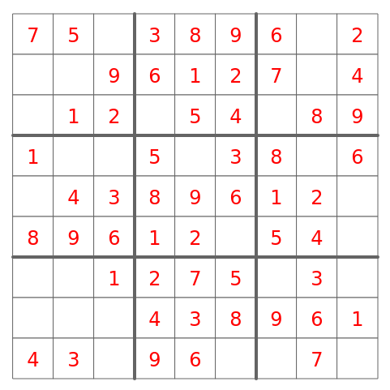

# Generating Sudoku with Shift Algorithm and solving it with Depth First Search ( DFS )

## Live Demo [Click Here!!](https://thenirmalkc.github.io/sudoku/)



## Generating Sudoku with Shift Algorithm

Using **Shift Algorithm** is one of the easiest way to generate sudoku. I will be showing example of generating 9X9 sudoku. Here, we first generate a solved sudoku using **Shift Algorithm** then we can remove the values from a solved sudoku at random positions to create a sudoku puzzle.

#### Steps

- Create a list with numbers from 1-9 at random position

```js
[ 1  7  5  2  3  6  8  4  9 ]
```

- For the 2nd row we shift the elements of 1st row by 3 from its current position

```js
[ 1  7  5  2  3  6  8  4  9 ]
[ 8  4  9  1  7  5  2  3  6 ] => 3 shift
```

- For the 3rd row we do the same and shift the elements of 2nd row by 3 from its current position

```js
[ 1  7  5  2  3  6  8  4  9 ]
[ 8  4  9  1  7  5  2  3  6 ] => 3 shift
[ 2  3  6  8  4  9  1  7  5 ] => 3 shift
```

- For the 4th row we shift the elements of 3rd row by 1 from its current position

```js
[ 1  7  5  2  3  6  8  4  9 ]
[ 8  4  9  1  7  5  2  3  6 ] => 3 shift
[ 2  3  6  8  4  9  1  7  5 ] => 3 shift
[ 5  2  3  6  8  4  9  1  7 ] => 1 shift
```

- For the 5th 6th 7th and 8th row, shift its previous row elements by 3, 3, 1, 3 and 3 respectively

```js
_______________________________
[ 1  7  5 | 2  3  6 | 8  4  9 ]             |
[ 8  4  9 | 1  7  5 | 2  3  6 ] => 3 shift  | Block 1
[ 2  3  6 | 8  4  9 | 1  7  5 ] => 3 shift  |
_______________________________
[ 5  2  3 | 6  8  4 | 9  1  7 ] => 1 shift  |
[ 9  1  7 | 5  2  3 | 6  8  4 ] => 3 shift  | Block 2
[ 6  8  4 | 9  1  7 | 5  2  3 ] => 3 shift  |
_______________________________
[ 3  6  8 | 4  9  1 | 7  5  2 ] => 1 shift  |
[ 7  5  2 | 3  6  8 | 4  9  1 ] => 3 shift  | Block 3
[ 4  9  1 | 7  5  2 | 3  6  8 ] => 3 shift  |
_______________________________
```

**We can also shuffle the rows within the block to hide the patters.** _( Note: Shuffling the rows is only possible within the block. If rows are shuffled outside of its block it no longer generates a valid sudoku. )_

**Now, we can remove numbers from the solved sudoku at random positions to generate a sudoku puzzle.**

## Solving Sudoku with Depth First Search ( DFS )

**Depth First Search** is a brute force search which visits the empty cells in some order and fills a valid digits sequentially. If none of the digits are found to be not valid it backtracks to its previous visited cell and fills it with a new valid number in hopes of providing a new valid value to next empty cell. The new value may or maynot be a valid value for the next empty cell. If not then, multiple backtracking can occur between already visited cells untill a new valid value is obtained.

#### Implementation Example from Wikipedia

_A program would solve a puzzle by placing the digit "1" in the first cell and checking if it is allowed to be there. If there are no violations (checking row, column, and box constraints) then the algorithm advances to the next cell and places a "1" in that cell. When checking for violations, if it is discovered that the "1" is not allowed, the value is advanced to "2". If a cell is discovered where none of the 9 digits is allowed, then the algorithm leaves that cell blank and moves back to the previous cell. The value in that cell is then incremented by one. This is repeated until the allowed value in the last (81st) cell is discovered._
